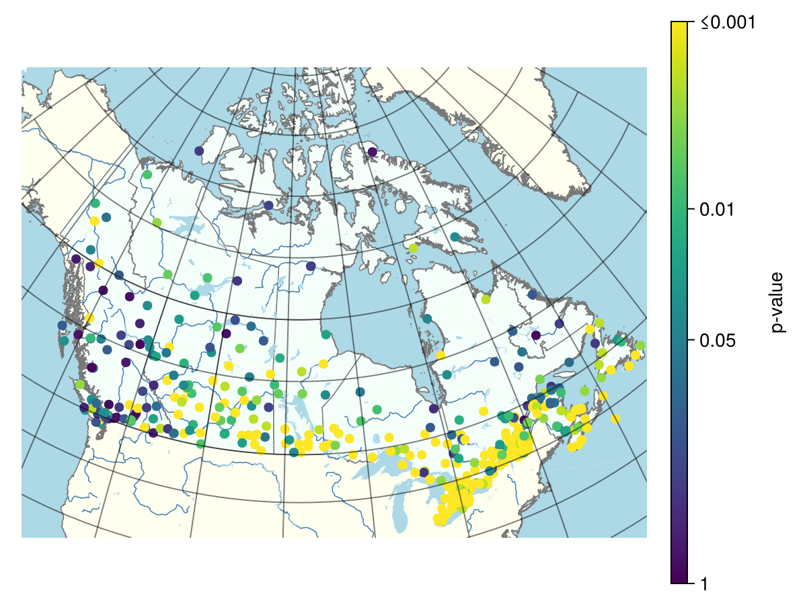
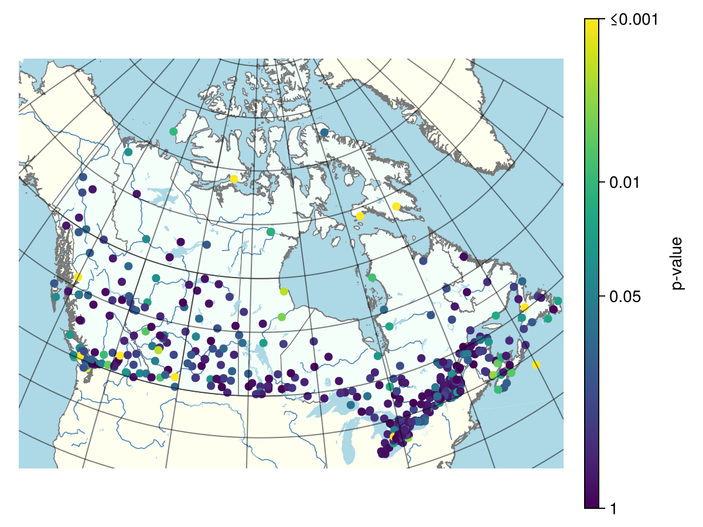

# All Canadian stations

```julia
using CSV, DataFrames, IDFCurves
using CairoMakie, CanadaMap
```

This section presents precomputed results for all Canadian stations. The results
can be reproduced using the `application.jl` script available in this
repository.

Load the precomputed results:
```julia canada
filename = normpath(joinpath(@__DIR__, "..","..","..", "data", "scalingtest_canadian_stations.csv"))
df = CSV.read(filename, DataFrame)
```

## Simple scaling

Extract the bootstrap-based goodness-of-fit p-values for the Simple Scaling
model 
```julia
p = clamp.(df.SimpleScaling_pvalue, 1e-10, 1.0)
values = -log10.(p)
```

Generate an empty map of Canada
```julia
fig, ga = generate_canada_map()
```

Displays the p-values on the map
```julia
sc = scatter!(
    ga,
    df.Lon,
    df.Lat;
    color = values,
    colormap = :viridis,
    colorrange = (0, 3),
    markersize = 10
)

Colorbar(
    fig[1, 2],
    sc;
    label = "p-value",
    ticks = (
        [0, -log10(0.05), 2, 3],
        ["1", "0.05", "0.01", "≤0.001"]
    )
)

ga.xticklabelsvisible[] = false
ga.yticklabelsvisible[] = false

fig #hide

#save(joinpath(@__FILE__, filepath, "simple_scaling_pvalue.png"), fig; pt_per_unit = 1) #hide
```


## General scaling

Extract the bootstrap-based goodness-of-fit p-values for the General Scaling
model 
```julia
p = clamp.(df.GeneralScaling_pvalue, 1e-10, 1.0)
values = -log10.(p)
nothing #hide
```

Generate an empty map of Canada
```julia
fig, ga = generate_canada_map()
nothing #hide
```

Displays the p-values on the map:
```julia
sc = scatter!(
    ga,
    df.Lon,
    df.Lat;
    color = values,
    colormap = :viridis,
    colorrange = (0, 3),
    markersize = 10
)

Colorbar(
    fig[1, 2],
    sc;
    label = "p-value",
    ticks = (
        [0, -log10(0.05), 2, 3],
        ["1", "0.05", "0.01", "≤0.001"]
    )
)

ga.xticklabelsvisible[] = false
ga.yticklabelsvisible[] = false

fig #hide

#save(joinpath(@__FILE__, filepath, "simple_scaling_pvalue.png"), fig; pt_per_unit = 1) #hide
```

